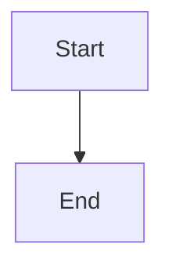

# Update Azure DevOps Wiki Page

Arguments: $ARGUMENTS

Expected format: `<wiki-name> <page-path>`
Example: `Team%20Wiki /Architecture%20Overview`

## Your task

Update a wiki page in Azure DevOps. This requires getting the current ETag (for optimistic concurrency), then updating with the new content.

## Important notes

- URL-encode spaces in wiki/page names (`%20`)
- `versionDescriptor.versionType=branch` and `versionDescriptor.version=main` are **required**
- `If-Match` header with ETag is **required** for existing pages

## Process

### Step 1: Get current page and ETag

```powershell
$wikiName = "<WIKI_NAME>"
$pagePath = "/<PAGE_PATH>"
$baseUrl = "https://devops.example.com/DefaultCollection/MyProject/_apis/wiki/wikis/$wikiName/pages"

$response = Invoke-WebRequest -Uri "$baseUrl`?path=$pagePath&api-version=6.0&includeContent=true" -UseDefaultCredentials
$etag = $response.Headers.ETag
$currentContent = ($response.Content | ConvertFrom-Json).content
Write-Output "ETag: $etag"
Write-Output "Current content: $currentContent"
```

### Step 2: Ask for new content

Ask the user what content should go on the wiki page.

### Step 3: Update the page

```powershell
$body = @{ content = "# Page Title`n`nContent here..." } | ConvertTo-Json -Depth 5

Invoke-RestMethod -Uri "$baseUrl`?path=$pagePath&api-version=6.0&versionDescriptor.versionType=branch&versionDescriptor.version=main" -Method Put -Body $body -ContentType "application/json" -Headers @{ "If-Match" = $etag } -UseDefaultCredentials
```

## Mermaid Diagrams - Azure DevOps Syntax

Azure DevOps uses **different syntax** than standard markdown for Mermaid:

**Correct (Azure DevOps)**:
```
::: mermaid
flowchart TB
    A[Start] --> B[End]
:::
```

**Wrong (standard markdown - won't render)**:
~~~

~~~

### Mermaid limitations in Azure DevOps

- No markdown formatting (`**bold**`) inside node labels
- No HTML tags (`<br/>`) inside node labels
- `classDef` styling may not work - keep diagrams simple
- Use plain text labels and add detailed descriptions below the diagram

## Common wikis

| Wiki | URL-encoded name |
|------|------------------|
| Team Wiki | `Team%20Wiki` |

## Error handling

- If ETag doesn't match (412 error): Someone else edited the page, fetch new ETag and retry
- If page doesn't exist (404): Use POST instead of PUT to create it
